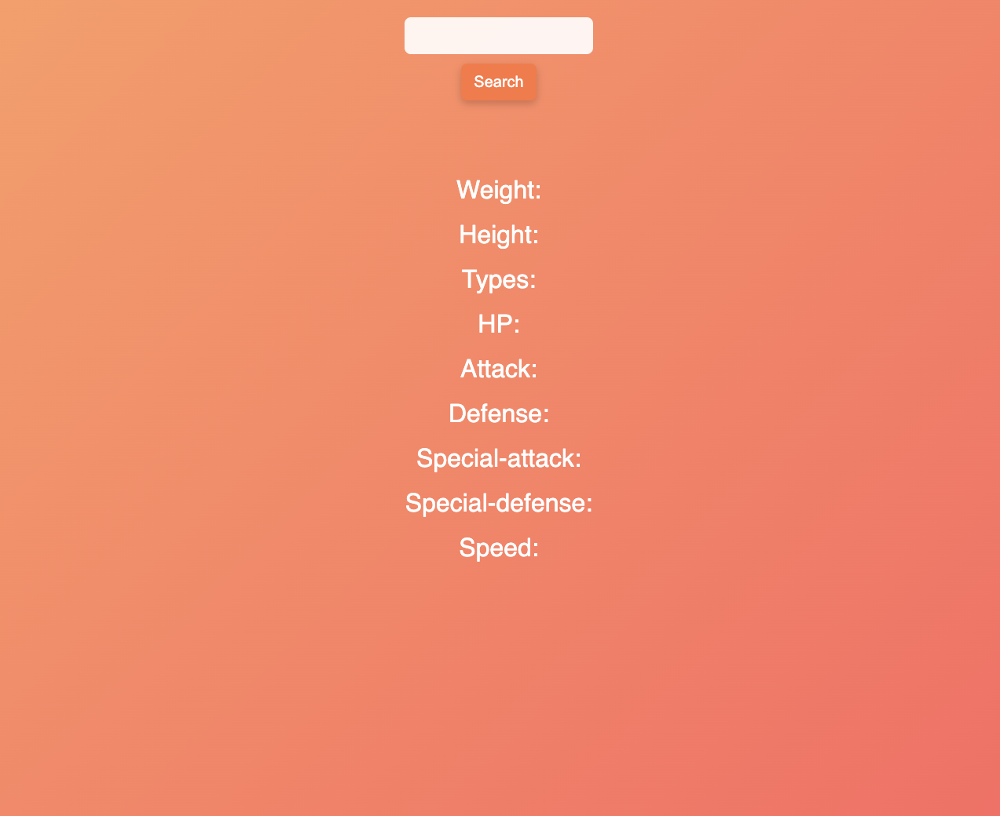
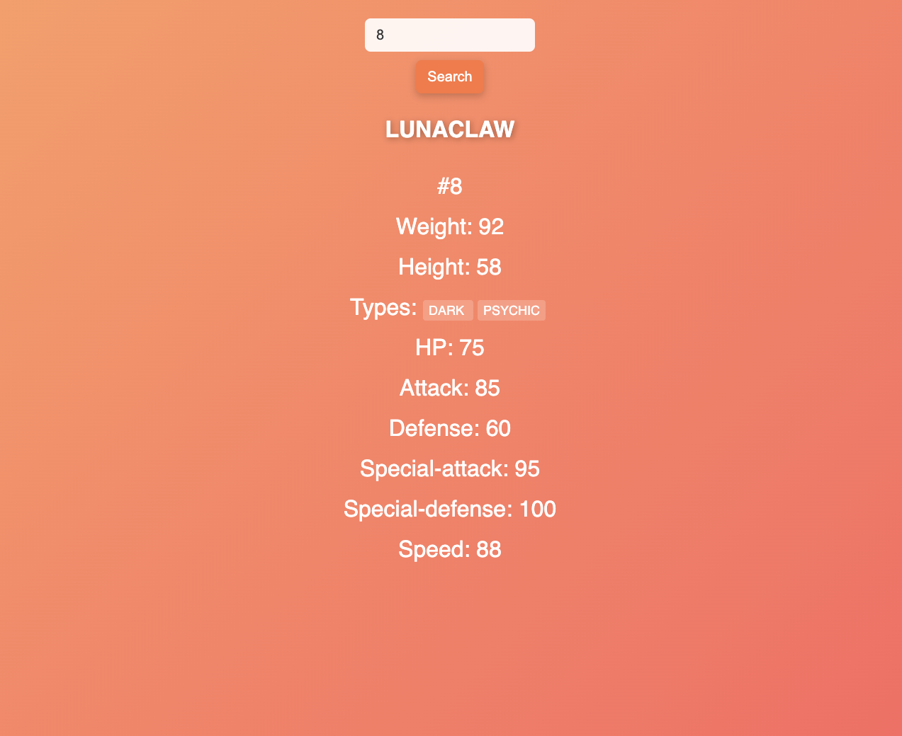

# 🐲 RPG Creature Search App

Приложение для поиска существ из RPG-вселенной по имени или ID.  
Позволяет узнать характеристики монстра — вес, рост, типы и основные параметры (HP, атака, защита и т.д.).

---

## Функционал
- 🔍 Поиск существ по **имени или ID**
- 📊 Отображение характеристик (вес, рост, HP, атака, защита и др.)
- 💡 Красивый интерфейс с градиентным фоном
- ⚡ Быстрая работа без перезагрузки страницы

---

## Стек технологий
- **HTML5**
- **CSS3**
- **Vanilla JavaScript (ES6)**  
Без сторонних библиотек — всё своими руками .

---

## Скриншоты

### 🔸 Главный экран


### 🔸 Результат поиска


---

## Как запустить проект локально
```bash
git clone https://github.com/AugustCoonCat/rpg-creature-search-app.git
cd rpg-creature-search-app
open index.html
